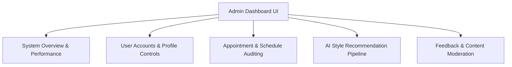

# HairIQ Admin Dashboard Technical Guide

This document outlines the architecture, layout, state management, and user operations of the **HairIQ Admin Console** (built inside `services/admin`).

---

## 1. Executive Summary & Console Role

The HairIQ Admin Dashboard serves as the centralized command center for administrators to monitor system performance, manage user accounts (Clients, Barbers, and Salons), moderate reviews, audit appointments, and supervise the AI styling recommendation engine.



---

## 2. Design System & User Interface Specifications

The interface is built with premium developer aesthetics following strict guidelines:
*   **Colors**: Custom, high-contrast palette including deep charcoal background (`#0d1117`), secondary card grids (`#161b22`), border strokes (`#30363d`), and active system highlights (Light Blue: `#58a6ff`, Purple: `#ab7df8`, Emerald Green: `#3fb950`).
*   **Typography**: Using clean, system-ui sans-serif fonts with modern text-scaling.
*   **Layout Structure**: Left-anchored sidebar navigation with a responsive grid workspace. On mobile/tablet widths, the sidebar automatically collapses to icon-only buttons to preserve viewport space.
*   **Aesthetics**: Glassmorphism overlays (`backdrop-filter: blur(8px)`) for pop-up modals, custom CSS scrollbars, state status indicators (pulsing neon lights), and smooth keyframe transitions.

---

## 3. Main Views & Navigation Panels

### 3.1 Overview Panel
Provides a birds-eye view of platform operations and system health:
*   **High-Level Metric Cards**: Shows MRR (Monthly Recurring Revenue), total users, active bookings, and AI performance percentages.
*   **Latency Meter Gauges**: Visually represents API response delays across three key operations:
    1.  *AI Portrait Scanning (Google Studio API)* (Avg 124ms)
    2.  *DRF Database Operations* (Avg 42ms)
    3.  *S3 Image Uploads* (Avg 286ms)
*   **Quick Action Center**: Quick-navigation triggers for admins to resolve flagged items.

### 3.2 Users & Profiles Database
A comprehensive list of registered user accounts from the backend's `CustomUserModel` schema:
*   **Role Identification**: Categorized using distinct colored badges (`BARBER`, `SALON`, `CLIENT`, `ADMIN`).
*   **Employee Identification**: Highlights whether an account is a sub-profile salon employee.
*   **Partner Verification Toggle**: Allows the admin to click **Verify** or **Revoke** to approve barbers or salons for platform discovery.
*   **Suspension Control**: Activates or suspends users, updating access limits immediately.
*   **Details Modal**: Renders detailed user bios, average review scores, total bookings counters, and registration timestamps.

### 3.3 Bookings Auditor
Audits client-to-stylist scheduling:
*   **Status Badging**: Visualizing appointment states (`PENDING`, `APPROVED`, `COMPLETED`, `CANCELLED`).
*   **Appointment Management**: Allows platform administrators to manually override scheduling states (e.g. approve a pending booking or cancel an approved session on behalf of users).
*   **Details Drawer**: Reviews specific details including service description, duration, pricing rate, and cancellation reasons.

### 3.4 AI Styling recommendations Engine
Facilitates and simulates AI analysis pipelines:
*   **Portrait Queue**: Displays portrait images uploaded by barbers.
*   **Mock Laser Scanning Animation**: Clicking **Run AI Analysis** activates a visual scanning overlay with a moving light bar, simulating facial boundary detection.
*   **Dynamic Outputs**: After a 3-second simulation, updates status labels to `COMPLETED` and renders a random suggested hairstyle (e.g. "Modern Textured Pompadour with Skin Fade"), replicating Google Studio integration.

### 3.5 Content Moderation Panel
Protects the platform's integrity:
*   **Review Filtering**: Allows filtering reviews by Approved or Flagged statuses.
*   **Moderation Controls**: Action buttons to **Approve Review** (removing flags), **Flag Content** (hiding reviews from public view), or **Delete** (purging reviews from the database).

---

## 4. State Management Architecture

The frontend is implemented as a single-page React application within `page.js` utilizing `useState` hooks to manage:
1.  **Mock Databases**: Local copies of users, bookings, reviews, and AI portrait queues, which update dynamically when actions (such as verifying or updating statuses) are performed.
2.  **Modals**: State hooks to track selected rows and display relevant data drawers.
3.  **Toasts**: Enforces feedback alerts with custom sliding transitions based on action outcomes (Green check for successes, Yellow circle for warnings, Red circle for failures/deletions).
4.  **Security Rules**: Enforces constraints such as preventing the deletion of salon employee sub-profiles directly by admins (warning the user to execute management on the owning Salon account).

---

## 5. Developer Execution & Launch Guide

### 5.1 Local Hosting Setup
To run the dashboard locally outside of Docker, navigate to `services/admin` and follow these instructions:

```bash
# 1. Reset permissions of the local Next.js and npm cache folders if needed
sudo chown -R $USER:$USER .next node_modules

# 2. Re-install system packages
npm install

# 3. Launch on port 3002 (if port 3001 is already bound to other dashboards)
PORT=3002 npm run dev
```

### 5.2 Docker Container Build
To run inside the monorepo Docker Compose stack, use the configured Makefile target:
```bash
# Starts all services locally (AI, Backend, Landing, and Admin Dashboard)
make up-local
```
This maps the admin container to the host port specified by `ADMIN_PORT` (defaults to `3001`).
