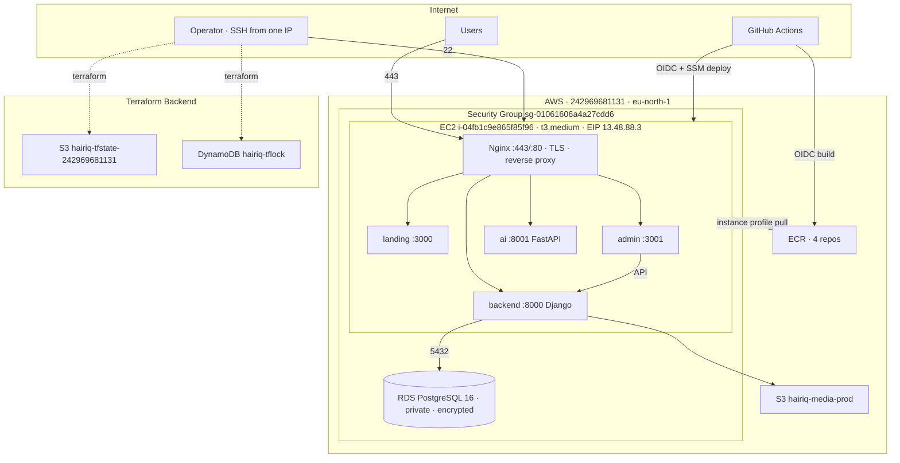

# HairIQ — Production DevOps Walkthrough

> A senior-engineer's review of everything we built, stage by stage.
> Written to be read by a backend developer newer to DevOps.
> Everything here describes the **real** deployed system, not a generic template.

**Live URLs:** https://hairlync.com · https://api.hairlync.com · https://ai.hairlync.com · https://admin.hairlync.com
**AWS account:** `242969681131` · **Region:** `eu-north-1` (Stockholm)
**Server:** EC2 `i-04fb1c9e865f85f96` @ Elastic IP `13.48.88.3`

---

## 0. The big picture

HairIQ is a monorepo with four services, each a Docker container, all running on a single EC2 box behind Nginx, talking to a managed PostgreSQL database (RDS). Images are built by GitHub Actions and stored in ECR. Infrastructure is defined in Terraform; the server is configured by Ansible; deployments happen automatically on every push to `main`.



**Why a single EC2 box?** At HairIQ's current scale (launch), one right-sized box is cheaper, simpler, and easier to reason about than Kubernetes or multiple instances. The architecture is intentionally "boring" — boring is good in production. Section "at larger scale" in each stage explains the upgrade path.

---

## Stage 1 — Terraform (Infrastructure as Code)

### 1. What we built
- A **bootstrap** stack ([infrastructure/terraform/bootstrap/](../infrastructure/terraform/bootstrap/)): the S3 state bucket, the DynamoDB lock table, the 4 ECR repositories, the GitHub OIDC provider, and the CI IAM role.
- A reusable **shared module** ([infrastructure/terraform/shared/](../infrastructure/terraform/shared/)): EC2, Elastic IP, S3 media bucket, RDS, security group, SSH key pair, the EC2 instance-profile/role, and an AMI lookup.
- Two **environments** (production, staging) that call the shared module with different sizes/names.
- A **remote state backend** (S3 + DynamoDB) so state is shared, versioned, encrypted, and locked.

### 2. Why we built it
Clicking resources together in the AWS Console is unrepeatable and undocumented. Terraform makes the infrastructure a reviewable, version-controlled artifact: you can destroy and recreate the whole environment from code, see every change as a diff, and never wonder "what's actually deployed?"

### 3. How it works internally
Terraform reads `.tf` files, builds a dependency graph, and computes a plan (the diff between desired config and the recorded **state**). `apply` calls AWS APIs to converge reality to the config, then records the result in state. State lives in `s3://hairiq-tfstate-242969681131/<env>/terraform.tfstate`; a **DynamoDB** item (`hairiq-tflock`) acts as a mutex so two `apply`s can't run at once. The AMI is chosen at plan time by a data source ([shared/data.tf](../infrastructure/terraform/shared/data.tf)) querying Canonical's latest Ubuntu 24.04 image, so there are no hardcoded, region-specific AMI IDs.

### 4. How to verify it
```bash
cd infrastructure/terraform/environments/production
terraform init -backend-config=backend.hcl
terraform plan            # should say "No changes" when in sync
terraform output          # server_ip = 13.48.88.3, rds_endpoint (sensitive)
aws s3 ls s3://hairiq-tfstate-242969681131/production/
aws dynamodb describe-table --table-name hairiq-tflock --region eu-north-1
```

### 5. Common production failures
- **Local state on a laptop** → lost or conflicting state, secrets on disk. (We avoided this with the S3 backend.)
- **Hardcoded AMI** → breaks in another region or when the image is deprecated.
- **State drift** — someone changes a resource in the Console; the next `apply` may revert it.
- **Provider/version skew** between engineers — pin versions (`versions.tf`).

### 6. Troubleshooting steps
- `Error acquiring the state lock` → another apply is running, or a crashed one left a stale lock → `terraform force-unlock <ID>`.
- Unexpected destroy/replace in the plan → read the `# forces replacement` lines before approving.
- Drift → `terraform plan` shows the diff; `terraform apply` reconciles, or `terraform import` adopts a manually-created resource.

### 7. Security considerations
- State contains **secrets in plaintext** (DB password) → the bucket is private, versioned, encrypted; `backend.hcl`, `*.tfvars`, `*.tfstate` are all gitignored. The repo is public, so this matters a lot.
- Secrets are injected via gitignored `terraform.tfvars` / `TF_VAR_*`, never committed.

### 8. Cost considerations
- State bucket + lock table: effectively **$0** (kilobytes + pay-per-request DynamoDB).
- Terraform itself is free; cost comes from the resources it creates (next stage).

### 9. At a larger scale
- Split state per component (network / data / compute) to limit blast radius.
- Use Terraform Cloud / Spacelite or Atlantis for plan/apply in CI with policy checks (OPA/Sentinel).
- A custom VPC module with public/private subnets instead of the default VPC.

### 10. Interview-level explanation
> "Terraform is declarative IaC. It reconciles desired config against a state file via a dependency graph. We use an S3 remote backend with DynamoDB locking for shared, versioned, mutually-exclusive state, a reusable module for the per-environment infra, and a one-time bootstrap stack (local state) to create the backend itself and the global CI identity."

---

## Stage 2 — AWS Resources

### 1. What we built
EC2 (t3.medium, Ubuntu 24.04, 30 GB encrypted gp3, Elastic IP `13.48.88.3`), RDS PostgreSQL 16 (db.t3.micro, 20 GB, encrypted, private, deletion-protected, 7-day backups), S3 media bucket, a security group, an SSH key pair, 4 ECR repos, and the Terraform state backend.

### 2. Why we built it
- **EC2** runs the containers + Nginx. t3.medium (2 vCPU/4 GB) because 4 containers + Next.js builds need the RAM.
- **RDS** is managed PostgreSQL — AWS handles backups, patching, failover plumbing, so we don't run a database by hand.
- **S3** for user-uploaded media (durable object storage, not the instance disk).
- **ECR** is a private, IAM-controlled image registry (better than Docker Hub: no rate limits, no extra credentials, scan-on-push).

### 3. How it works internally
The EC2 boots from the Ubuntu AMI, gets the Elastic IP attached (a stable address that survives stop/start), and runs everything in the **default VPC**. RDS lives in the same security group; the app reaches it over the private network on `5432`. The EC2 has an **instance profile** so the AWS CLI/SDK on the box gets temporary credentials from instance metadata (IMDS) — used to pull from ECR.

### 4. How to verify it
```bash
aws ec2 describe-instances --instance-ids i-04fb1c9e865f85f96 --region eu-north-1 \
  --query 'Reservations[].Instances[].[InstanceType,State.Name,PublicIpAddress]'
aws rds describe-db-instances --db-instance-identifier hairiq-production-db --region eu-north-1 \
  --query 'DBInstances[0].[DBInstanceStatus,StorageEncrypted,PubliclyAccessible,DeletionProtection]'
ssh -i ~/.ssh/id_rsa ubuntu@13.48.88.3 'df -h / && free -m'
```

### 5. Common production failures
- **Disk full** — Docker images/logs fill the root volume → containers crash. We mitigated with a 30 GB volume + `docker system prune` during deploys.
- **RDS public accidentally** — the #1 database breach cause. Ours is `publicly_accessible = false`.
- **Lost Elastic IP** — stopping an instance without an EIP changes its IP; we use an EIP so the address is stable.
- **Instance store vs EBS confusion** — our root volume is EBS (persists); app *data* is in RDS/S3, not on the box.

### 6. Troubleshooting steps
- Unreachable server → check instance `State`, your current public IP vs the SSH allow-list, `nc -vz 13.48.88.3 22`, then EC2 status checks / serial console.
- DB connection issues → test from the **box** (it's private), verify the container is in the SG, check `DatabaseConnections` in CloudWatch.
- High CPU on t3 → you may be exhausting burst credits; check `CPUCreditBalance`.

### 7. Security considerations
- RDS encrypted at rest, private, deletion-protected.
- EBS encrypted.
- SSH limited to one IP (see security group).
- S3 media bucket blocks public ACLs but allows public **read** of `static/*` and `media/*` (intentional, for serving assets). A stricter design uses CloudFront + a private bucket.

### 8. Cost considerations (rough, eu-north-1)
| Resource | ~$/mo |
|---|---|
| EC2 t3.medium | ~$34 |
| 30 GB gp3 | ~$2.50 |
| RDS db.t3.micro | ~$14 (likely Free Tier first 12 months) |
| RDS storage 20 GB | ~$2.50 |
| Elastic IP | ~$3.60 |
| S3 + ECR | ~$1–2 |
| **Total** | **~$55–60** |

Stop the EC2 to pause compute cost without destroying anything.

### 9. At a larger scale
- Auto Scaling Group + Application Load Balancer across AZs.
- RDS Multi-AZ (standby failover) + read replicas.
- Custom VPC with private subnets; app servers with no public IP, reached only via the ALB.
- CloudFront in front of S3 for media.

### 10. Interview-level explanation
> "A single t3.medium runs the containerized stack behind Nginx; managed RDS (encrypted, private, backed up) holds relational data; S3 holds media; an Elastic IP gives a stable address; an instance profile grants the box temporary credentials to pull images. It's a deliberately simple single-node topology with a clear scale-out path to ASG+ALB+Multi-AZ."

---

## Stage 3 — Ansible (Configuration Management)

### 1. What we built
Roles that turn a bare Ubuntu box into our app host: **docker** (Docker CE + compose plugin + AWS CLI), **nginx** (reverse proxy + shared security/rate-limit configs), **app-deploy** (mirror the `deployment/` subtree + env files + `server-deploy.sh`, then bring the stack up), and **certbot** (TLS). Plus [ansible.cfg](../infrastructure/ansible/ansible.cfg), an inventory pointing at `13.48.88.3`, and group/role variables.

### 2. Why we built it
The server needs software installed and config files placed *the same way every time*. Doing it by hand (SSH + apt + edit files) is unrepeatable. Ansible makes server setup idempotent and documented — rebuild the box and re-run the playbook to get an identical server.

### 3. How it works internally
Ansible connects over SSH (no agent on the box), gathers facts, and runs each role's tasks. Tasks are **idempotent** — they declare desired state ("nginx installed", "this file present") and only change what's needed. We tag roles (`base`, `app`, `ssl`) so we can run a subset:
```bash
ansible-playbook -i inventories/production/hosts -e env=production playbooks/site.yml --tags base   # docker+nginx
ansible-playbook ... --tags app    # deploy files + bring up
ansible-playbook ... --tags ssl    # certbot
```
The server **mirrors the repo's `deployment/` subtree**, so the exact `docker compose -f base -f override` command runs identically locally and on the box.

### 4. How to verify it
```bash
ansible -i inventories/production/hosts webservers -m ping       # pong
ssh ubuntu@13.48.88.3 'docker --version && systemctl is-active nginx && nginx -t'
```

### 5. Common production failures
- **Handler didn't fire** — handlers only run when a notifying task reports `changed`. (We hit this: a copy task without `notify` meant no deploy.)
- **Empty-string vs undefined** — `lookup('env','X') | default('y')` does NOT apply the default to an empty string; you need `default('y', true)`. (This bug made `project_path` wrong.)
- **Roles not found** — without `ansible.cfg`'s `roles_path`, roles one level up from the playbook aren't discovered.
- **Handler file shape** — role `handlers/main.yml` must be a flat task list, not wrapped in a `handlers:` key.

### 6. Troubleshooting steps
- `--syntax-check` and `--list-tasks` before running.
- `-vvv` for verbose SSH/task output.
- Run a single role with `--tags`, or `--start-at-task`.
- `--check --diff` for a dry run showing what would change.

### 7. Security considerations
- Connects as `ubuntu` over key-based SSH (from your allow-listed IP).
- Env files are written `0600` (owner-only).
- No secrets in the playbook — they come from gitignored env files.

### 8. Cost considerations
- Ansible is free and runs from your laptop / CI. No runtime cost.

### 9. At a larger scale
- Bake an AMI with Packer (pre-installed Docker/Nginx) so new instances boot ready — pair with ASG.
- Or move to immutable infra: the image *is* the server, no in-place config.
- Ansible Vault or AWS Secrets Manager for secret material instead of local env files.

### 10. Interview-level explanation
> "Ansible is agentless, idempotent configuration management over SSH. We use tagged roles to install Docker/Nginx, lay down the compose + env files mirroring the repo, and obtain TLS. It's the one-time provisioning path; continuous deploys are handled by CI."

---

## Stage 4 — CI/CD (GitHub Actions → ECR → SSM)

### 1. What we built
[.github/workflows/deploy.yml](../.github/workflows/deploy.yml): on push to `main`, a **build** job authenticates to AWS via **OIDC**, pushes 4 images to ECR (tagged `:latest` + `:<git-sha>`), then a **deploy** job uses **AWS SSM** to run [server-deploy.sh](../deployment/scripts/server-deploy.sh) on the box (ECR login via instance profile → pull → up → migrate). Plus [rollback.sh](../deployment/scripts/rollback.sh) and PR checks.

### 2. Why we built it
Manual deploys (SSH in, pull, restart) are error-prone and undocumented. CI/CD makes every deploy identical, traceable to a commit, and automatic — push code, get production.

### 3. How it works internally
- **OIDC**: GitHub mints a short-lived signed token describing the workflow; AWS trusts GitHub's issuer and exchanges it for 15-minute credentials to assume `hairiq-github-ci`. **No static AWS keys exist in GitHub.**
- **Tagging**: `:<sha>` is immutable/traceable (what we deploy + roll back to); `:latest` is a convenience pointer.
- **SSM deploy**: instead of SSH-ing in (which would need port 22 open to GitHub's IPs), the deploy job tells **Systems Manager** to run a command *inside* the instance. The SSM agent (already on Ubuntu) executes `server-deploy.sh`. **No inbound SSH, no keys on the server.**
- **Migrations**: one controlled `migrate --noinput` after `up` (also idempotent; the backend entrypoint runs it too).
- **Rollback**: `REGISTRY=… EC2_HOST=… ./rollback.sh <sha>` redeploys a prior image (ECR lifecycle keeps the last 20).

### 4. How to verify it
```bash
# images present with both tags
aws ecr describe-images --repository-name hairiq-backend --region eu-north-1 \
  --query 'sort_by(imageDetails,&imagePushedAt)[-1].imageTags'
# box running the expected sha
ssh ubuntu@13.48.88.3 'docker ps --filter name=hairiq-backend --format "{{.Image}} {{.Status}}"'
```
Watch the run at the repo's **Actions** tab.

### 5. Common production failures
- **OIDC `sub` mismatch** — a job with `environment: production` gets `sub=…:environment:production`, not the branch sub; the trust policy must allow both. (We hit exactly this.)
- **CI can't reach the box** — SG blocks GitHub runner IPs on :22. (Why we use SSM, not SSH.)
- **Deploy assumes files exist** — the box must be provisioned by Ansible first.
- **Bad migration** breaks the app — deploy gate + rollback mitigate.

### 6. Troubleshooting steps
- Build fails at "Configure AWS credentials" → OIDC trust/`permissions: id-token: write`/role ARN.
- Deploy "instance not connected" → SSM agent not registered; check the EC2 role has `AmazonSSMManagedInstanceCore` and `aws ssm describe-instance-information`.
- Image not updating → confirm the deploy job ran and `IMAGE_TAG` matched the pushed tag.
- Inspect on-box: `docker compose ... logs`, `docker ps`.

### 7. Security considerations
- **Zero static credentials** anywhere (OIDC for CI, instance profile for the box).
- No inbound SSH from CI; port 22 stays closed to the world.
- CI role is scoped to ECR push + SSM send on this account; the EC2 role is ECR **read-only** + SSM core.
- GitHub `environment: production` enables deployment protection (optional required reviewers).

### 8. Cost considerations
- GitHub Actions minutes (free tier generous for one repo); ECR storage trimmed by a lifecycle policy (last 20 images). Effectively a few dollars/month at most.

### 9. At a larger scale
- Blue/green or canary deploys behind the ALB (shift traffic gradually).
- Separate build vs deploy pipelines; promote the *same* image artifact through staging → prod.
- Migration safety: expand/contract pattern, run migrations as a dedicated job, automated DB backups pre-deploy.

### 10. Interview-level explanation
> "Push to main triggers an OIDC-authenticated build that pushes SHA-tagged images to ECR, then a deploy job uses SSM Run Command to execute an on-box script that pulls and restarts via the instance profile. No static credentials and no inbound SSH — the box is reached through SSM, and both CI and server identities are short-lived/role-based."

---

## Stage 5 — DNS

### 1. What we built
GoDaddy A records: `hairlync.com`, `api.`, `ai.`, `admin.` → `13.48.88.3` (and `www` → apex).

### 2. Why we built it
Users need human names, not an IP. Nginx routes by `server_name`, so each subdomain maps to a service. DNS is also a prerequisite for TLS (Let's Encrypt validates domain ownership over HTTP).

### 3. How it works internally
A DNS resolver walks root → `.com` → GoDaddy's authoritative nameservers, which return `13.48.88.3` for each name. The browser connects to that IP with a `Host:` header; Nginx matches `server_name` and proxies to the right container port.

### 4. How to verify it
```bash
dig +short A hairlync.com @8.8.8.8         # 13.48.88.3
dig +short A api.hairlync.com @1.1.1.1     # 13.48.88.3
curl -I http://hairlync.com                # reaches Nginx
```

### 5. Common production failures
- **Propagation delay / stale TTL** — changes take time; old values cached.
- **Wrong record type** (CNAME on the apex isn't allowed by classic DNS; use A or ALIAS).
- **Missing `www`** — a cert request for `www` fails if it doesn't resolve.

### 6. Troubleshooting steps
- `dig`/`nslookup` against multiple public resolvers.
- Check the authoritative nameservers (`dig NS hairlync.com`).
- Lower TTL before planned changes.

### 7. Security considerations
- Consider CAA records (restrict which CAs can issue) and DNSSEC.
- The EIP is fixed, so records are stable (no dangling-DNS takeover risk from a changing IP).

### 8. Cost considerations
- Domain registration (~$10–20/yr at GoDaddy); DNS hosting is included.

### 9. At a larger scale
- Move DNS to Route 53 for tight AWS integration, health-checked failover, latency/geo routing, and alias records to an ALB/CloudFront.

### 10. Interview-level explanation
> "A records point the apex and subdomains at the Elastic IP; Nginx virtual-hosts on `server_name` to route each subdomain to its container. DNS also underpins ACME domain validation for TLS."

---

## Stage 6 — SSL / TLS (Let's Encrypt via Certbot)

### 1. What we built
A single Let's Encrypt certificate covering `hairlync.com, www., api., ai., admin.`, installed by `certbot --nginx`, with HTTP→HTTPS redirect and an auto-renewal timer.

### 2. Why we built it
Encryption in transit is mandatory for a real product (passwords, tokens, privacy, browser trust, SEO). Let's Encrypt is free and automatable.

### 3. How it works internally
Certbot proves domain control via the **HTTP-01 challenge**: it places a token at `http://<domain>/.well-known/acme-challenge/…`, Let's Encrypt fetches it, then issues a 90-day cert. The `--nginx` plugin edits the Nginx config to add `443` server blocks (`ssl_certificate …/live/hairlync.com/fullchain.pem`) and an 80→443 redirect. `certbot.timer` runs twice daily and renews when <30 days remain.

### 4. How to verify it
```bash
curl -I https://hairlync.com                         # 200
curl -I http://hairlync.com                          # 301 -> https
echo | openssl s_client -connect hairlync.com:443 -servername hairlync.com 2>/dev/null \
  | openssl x509 -noout -dates -ext subjectAltName
ssh ubuntu@13.48.88.3 'sudo certbot renew --dry-run' # "all simulated renewals succeeded"
```

### 5. Common production failures
- **Renewal fails silently** → expired cert, browser errors. Mitigated by the `--dry-run` we verified + the timer.
- **Re-running the Nginx role clobbers Certbot's edits** → HTTPS drops. Rule: run `--tags nginx,ssl` together, or `ssl` after `nginx`.
- **Rate limits** — Let's Encrypt limits ~5 certs/domain/week; don't loop issuance.
- **Port 80 blocked** → HTTP-01 challenge fails.

### 6. Troubleshooting steps
- `sudo certbot certificates` (what's installed, expiry).
- `sudo journalctl -u certbot` / `systemctl list-timers certbot.timer`.
- `nginx -t` after any cert change; reload Nginx.

### 7. Security considerations
- Add HSTS, prefer TLS 1.2+/strong ciphers (Mozilla SSL config generator), OCSP stapling.
- Private keys live in `/etc/letsencrypt` (root-only); never leave the box.

### 8. Cost considerations
- Let's Encrypt is **free**. The only cost is the compute already running.

### 9. At a larger scale
- Terminate TLS at an ALB with **ACM** certs (auto-renewed, no on-box certbot), or CloudFront for edge TLS. DNS-01 challenge (via Route 53) for wildcard certs.

### 10. Interview-level explanation
> "Certbot obtains a Let's Encrypt cert via the HTTP-01 challenge and configures Nginx for TLS termination with an HTTP→HTTPS redirect; a systemd timer auto-renews the 90-day cert. At scale we'd terminate TLS at an ALB with ACM-managed certificates."

---

## Credentials & secrets map (where everything lives)

| Secret | Where it lives | How it reaches runtime |
|---|---|---|
| AWS access keys (operator) | `~/.aws/credentials` on your laptop | AWS CLI/Terraform |
| DB password | gitignored `terraform.tfvars` + `.env.production.backend` (box, `0600`) | RDS at create; Django via env |
| Django `SECRET_KEY`, superuser pw | `.env.production.backend` on the box | container env |
| OpenAI/Anthropic keys | `.env.production.ai` on the box | container env |
| CI → AWS | **nothing stored** — GitHub OIDC → assume `hairiq-github-ci` | 15-min STS creds |
| Box → ECR | **nothing stored** — EC2 instance profile (IMDS) | temporary creds |
| GitHub secrets | `AWS_ROLE_ARN`, `EC2_HOST`, `EC2_SSH_PRIVATE_KEY` | Actions |
| TLS private keys | `/etc/letsencrypt` on the box (root) | Nginx |

**Never committed** (all gitignored): `AWS.text`, `*.tfvars`, `*.tfstate`, `backend.hcl`, `.env.*`, `*.pem`, `*.key`.

---

## Gotchas we actually hit (and the fixes)

1. **Broken CI Dockerfile paths** — workflows referenced deleted `deployment/services/*/Dockerfile` → repointed to `services/*/Dockerfile`.
2. **Incomplete compose on the server** — only the override was shipped (no base) → mirror the subtree and always run `-f base -f override`.
3. **Landing Dockerfile was for Next.js** but the app is Vite → rewrote to build static + serve via Nginx.
4. **Stale `package-lock.json`** → `npm ci` failed → regenerated.
5. **Missing `ansible.cfg`** → roles undiscoverable → added `roles_path`.
6. **Role handler files wrapped in `handlers:`** → invalid → flattened.
7. **IAM user too narrow** → had to attach managed policies via root console (and IAMFullAccess later).
8. **CI couldn't SSH** (SG blocks runner IPs) → switched deploy to **SSM**.
9. **`project_name` empty** (`default()` doesn't catch empty strings) → `default('hairiq', true)`.
10. **OIDC `sub` differs with `environment:`** → added environment subjects to the trust policy.

---

## What's next
- **Monitoring** (Prometheus + Grafana) — wire up `deployment/monitoring/`, dashboards, alerts.
- **Security hardening** — least-privilege IAM, convert staging deploy to SSM, repo-manage the SSL Nginx config, delete `AWS.text`, CloudFront+private S3.
- **Backup & DR** — RDS snapshot strategy + a tested restore runbook.
- **Cost optimization** — right-sizing, budget alerts.
- **Go-live verification checklist.**
